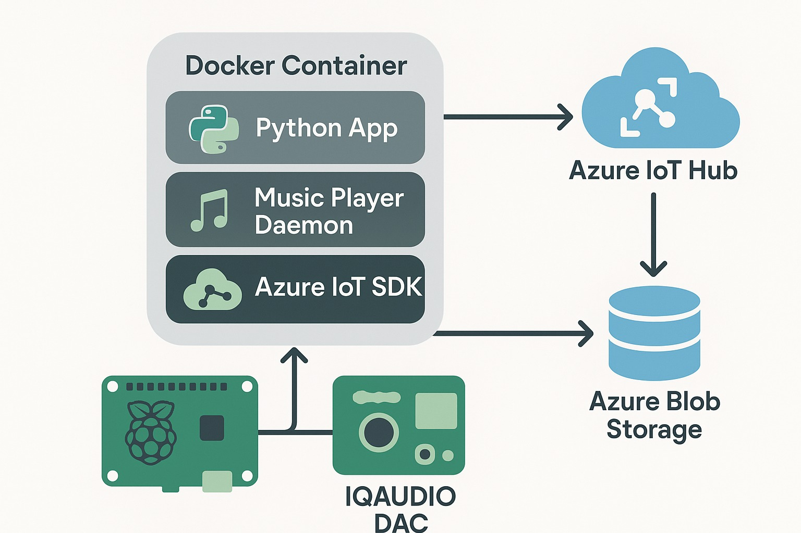

# AmoraOS - IoT Edge Audio Platform and SDK

A Python implementation of an edge device audio system that provides a custom SDK for seamless integration with Waybox applications. This project migrates from Arch Linux to Debian Bookworm on Raspberry Pi music boxes, enabling sophisticated edge audio capabilities with cloud connectivity.

> **Note:** The SDK now includes MQTT broker integration for real-time communication between devices and client applications, as well as Azure IoT Hub integration for device management and telemetry.

## Documentation

Comprehensive documentation is available in the [docs](docs/) directory:

- [Architecture](docs/architecture.md) - SDK architecture overview
- [Azure Architecture](docs/azure_architecture.md) - Azure IoT Hub integration architecture
- [Azure Implementation](docs/azure_implementation.md) - Azure IoT Hub implementation details
- [Client Development](docs/client_development.md) - Guide for developing client applications
- [Data Flow](docs/data_flow.md) - Data flow between components
- [Device Changes](docs/device_changes.md) - Changes required for device integration
- [Integration](docs/integration.md) - Integration with AmoraOS

### Browsing Documentation Locally

To browse the documentation with a local web server:

```bash
# From the project root directory
./serve_docs.sh

# Then open http://127.0.0.1:8000/ in your browser
```

This will start a local MkDocs server with the documentation.

## Features

### Edge Device Features
- Python-based edge audio player with MPD and MPC for control and playback
- Pipewire audio backend for modern audio routing
- Playlist management and playback control
- Development mode for testing on Linux host
- Containerized deployment with Debian Bookworm
- Support for IQUADIO PI DA audio HAT

### SDK Features
- MQTT broker integration for real-time communication
- Azure IoT Hub integration for device management and telemetry
- Device twin synchronization for state management
- Direct method invocation for remote control
- Telemetry for real-time status updates
- Reconnection handling with exponential backoff
- Comprehensive error handling and logging

### Development Features
- Poetry for dependency management
- Comprehensive test suite with unit and integration tests
- Mocking framework for testing without hardware
- Detailed documentation for all components

## Architecture



The application follows a modular architecture with containerized components on edge devices connecting to Azure IoT Hub and MQTT broker:

### Edge Device Components
- **Edge Device**: Raspberry Pi running Debian Bookworm with containerized components
- **Python App**: Main application logic handling device-side operations
- **Music Player Daemon**: Handles audio playback and playlist management
- **Raspberry Pi & IQAUDIO DAC**: Hardware platform for high-quality audio at the edge

### SDK Components
- **Device Module**: Core SDK functionality for device-side operations
  - **Player Module**: Music player implementation with MPD client
  - **IoT Module**: Azure IoT Hub integration for device management and telemetry
  - **Broker Module**: MQTT broker integration for real-time communication

### Cloud Components
- **Azure IoT Hub**: Manages device identity, security, and commands
- **Azure Event Hub**: Handles high-volume telemetry data for real-time status updates
- **MQTT Broker**: Enables real-time communication between devices and client applications

### Communication Flows
- **Device-to-Cloud**: Telemetry data sent to Azure IoT Hub and Event Hub
- **Cloud-to-Device**: Commands sent from Azure IoT Hub to devices
- **Device-to-Client**: Real-time status updates sent via MQTT broker
- **Client-to-Device**: Commands sent from client applications via MQTT broker

## Project Structure

```
amora-os/
├── edge/              # Edge device implementation
│   ├── src/           # Core application code
│   │   ├── main.py    # Entry point and CLI
│   │   ├── player.py  # Player implementation
│   │   └── utils.py   # Utility functions
│   ├── config/        # Configuration files
│   ├── scripts/       # Utility scripts
│   ├── samples/       # Sample music for testing
│   ├── tests/         # Edge device test suite
│   ├── Dockerfile     # Container definition
│   └── pyproject.toml # Poetry project definition
├── sdk/               # AmoraSDK for application integration
│   ├── amora_sdk/     # Core SDK code
│   │   ├── device/    # Device-side SDK implementation
│   │   │   ├── broker/  # MQTT broker communication
│   │   │   ├── iot/     # Azure IoT Hub integration
│   │   │   └── player/  # Music player implementation
│   │   └── __init__.py  # SDK entry point
│   ├── tests/         # Unit tests
│   └── integration_tests/ # Integration tests
├── docs/              # Documentation
│   └── images/        # Architecture diagrams
└── .gitignore         # Git ignore file
```

## Development

### Setup with Poetry

```bash
# Install Poetry
curl -sSL https://install.python-poetry.org | python3 -

# Install dependencies
poetry install

# Run the player
poetry run waybox-player start

# Run in development mode
poetry run waybox-player start --dev

# Test audio
poetry run waybox-player test-audio

# Run tests with coverage
poetry run pytest --cov=src
```

### Linux-Only Development

This project is now exclusively developed and maintained for Linux systems. Windows development is no longer supported.

## Docker

### Container Setup

The application uses a Docker container setup:

- Based on Debian Bookworm
- Uses a Python virtual environment with pip for dependency management
- Mounts the samples directory for music files in development mode
- Uses volume mounts for source code, configuration, and scripts in development mode
- Includes MPD, Pipewire, and other required system packages

### Build the Docker Image

```bash
docker build -t waybox-python-player .
```

Or use the dev.ps1 script (option 3).

### Run in Normal Mode

```bash
docker run -d --name waybox-player-python --privileged --network host \
  -v ./music:/home/user/music \
  --device /dev/snd:/dev/snd \
  --group-add audio \
  waybox-python-player
```

### Run in Development Mode (Audio to Windows Host)

```bash
docker run -d --name waybox-player-python-dev --privileged --network host \
  -v ./samples:/home/user/music \
  -v ./src:/home/user/app/src \
  -v ./config:/home/user/app/config \
  -v ./scripts:/home/user/app/scripts \
  --device /dev/snd:/dev/snd \
  --group-add audio \
  waybox-python-player python3 -m src.main start --dev
```

Note: The `samples` directory is mounted as `/home/user/music` in the container for development.

### Dependency Management

- Poetry is used for development on the host machine
- In the Docker container, we use a Python virtual environment with pip
- This approach provides a good balance between development experience and container stability
- When you add or update dependencies:
  1. Add them to pyproject.toml with Poetry:
     ```bash
     poetry add package-name
     ```
  2. Update the Dockerfile to include the new dependency in the pip install command
  3. Rebuild the container to apply the changes

Note: We use a virtual environment in the container because Debian Bookworm implements PEP 668, which prevents installing packages directly with pip into the system Python.

## Configuration

The application uses JSON configuration files:

```json
{
    "device": {
        "id": "waybox-player",
        "name": "Waybox Player"
    },
    "mpd": {
        "host": "localhost",
        "port": 6600
    },
    "content": {
        "storage_path": "/home/user/music",
        "playlists_path": "/home/user/music/playlists"
    },
    "audio": {
        "backend": "pipewire",
        "device": "default",
        "volume": 80
    },
    "dev_mode": false
}
```

## Audio Testing

To test audio functionality:

```bash
# Using the CLI
poetry run waybox-player test-audio

# Or directly with Python
python -m src.main test-audio
```

## Example Usage

See `scripts/example.py` for a complete example of how to use the player in your code:

```python
from player import MusicPlayer

# Create configuration
config = {
    "mpd": {"host": "localhost", "port": 6600},
    "content": {
        "storage_path": "/home/user/music",
        "playlists_path": "/home/user/music/playlists"
    },
    "audio": {"backend": "pipewire", "device": "default", "volume": 80}
}

# Create player instance
player = MusicPlayer(config)

# Connect to MPD
player.connect()

# Play audio
player.play()
```

## Sample Music Files

The project includes a `samples` directory for testing audio playback in development mode:

- Add MP3 files to the `samples` directory to test playback
- Create playlists by adding files to `samples/playlists/[playlist_name]`
- The `samples` directory is mounted as `/home/user/music` in the container
- For real testing, replace the placeholder text files with actual MP3 files

When running in development mode with the dev.ps1 script:
1. The script automatically mounts your local `samples` directory to `/home/user/music` in the container
2. It ensures proper permissions are set on the mounted directory
3. It updates the MPD database to recognize your music files
4. You can immediately play your music files using the player

### Testing Audio Playback

To quickly test audio playback with your sample MP3 files:

1. Start the container in dev mode using the dev.ps1 script (option 1)
2. When the bash shell opens in the container, run:
   ```bash
   /home/user/app/scripts/play-sample.sh
   ```
3. This script will:
   - Update the MPD database
   - List all available MP3 files
   - Add them to the playlist
   - Start playback
   - Show the current status

## Future Enhancements

### SDK Enhancements
- Client-side SDK for JavaScript/TypeScript applications
- React component library for quick integration
- Enhanced security with certificate-based authentication
- Support for additional MQTT brokers (AWS IoT Core, HiveMQ)

### Device Enhancements
- Content synchronization from Azure Blob Storage
- Over-the-air updates for AmoraOS on edge devices
- Fleet management capabilities for multiple edge devices
- Enhanced offline operation with cloud synchronization when available

### Cloud Enhancements
- Azure Digital Twins integration for device modeling
- Azure Functions for advanced device orchestration
- Power BI dashboards for fleet analytics
- Azure AD integration for secure access control
