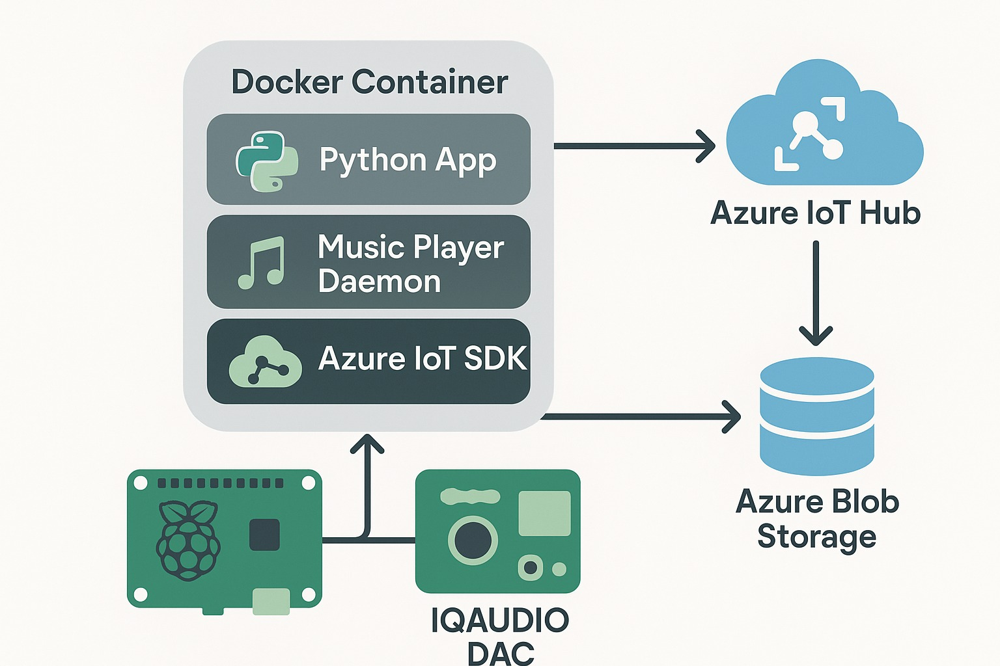

# AmoraOS Documentation

Welcome to the AmoraOS documentation. This guide provides information about the AmoraOS edge audio system and the AmoraSDK for application integration.

## Overview

AmoraOS is a Python implementation of an edge device audio system with a custom SDK for seamless integration with applications. The system runs on Debian Bookworm on Raspberry Pi devices, providing edge audio capabilities with cloud connectivity.



## Key Features

- Python-based edge audio player with MPD for playback control
- Azure IoT Hub integration for device management
- MQTT broker for real-time communication
- Pipewire audio backend for modern audio routing
- Containerized deployment with Debian Bookworm
- Support for IQUADIO PI DA audio HAT

## Architecture

The application follows a modular architecture with containerized components on edge devices connecting to Azure IoT Hub and MQTT broker:

### Edge Device Components
- **Edge Device**: Raspberry Pi running Debian Bookworm with containerized components
- **Python App**: Main application logic handling device-side operations
- **Music Player Daemon**: Handles audio playback and playlist management
- **Raspberry Pi & IQAUDIO DAC**: Hardware platform for high-quality audio at the edge

### SDK Components
- **Device Module**: Core SDK functionality for device-side operations
  - **Player Module**: Music player implementation with MPD client
  - **IoT Module**: Azure IoT Hub integration for device management and telemetry
  - **Broker Module**: MQTT broker integration for real-time communication

### Cloud Components
- **Azure IoT Hub**: Manages device identity, security, and commands
- **Azure Event Hub**: Handles high-volume telemetry data for real-time status updates
- **MQTT Broker**: Enables real-time communication between devices and client applications

### Communication Flows
- **Device-to-Cloud**: Telemetry data sent to Azure IoT Hub and Event Hub
- **Cloud-to-Device**: Commands sent from Azure IoT Hub to devices
- **Device-to-Client**: Real-time status updates sent via MQTT broker
- **Client-to-Device**: Commands sent from client applications via MQTT broker

## Getting Started

To get started with AmoraOS, follow these steps:

1. **Clone the Repository**
   ```bash
   git clone https://github.com/yourusername/amora-os.git
   cd amora-os
   ```

2. **Install Dependencies**
   ```bash
   poetry install
   ```

3. **Configure the Environment**
   ```bash
   cp .env.example .env
   # Edit .env with your configuration
   ```

4. **Run the Application**
   ```bash
   poetry run python -m edge.src.main
   ```

## Development

For development, you can use the provided development scripts:

```bash
# Start the development environment
./dev.sh start

# Run tests
./dev.sh test

# Build the container
./dev.sh build
```

## License

This project is licensed under the MIT License - see the LICENSE file for details.
